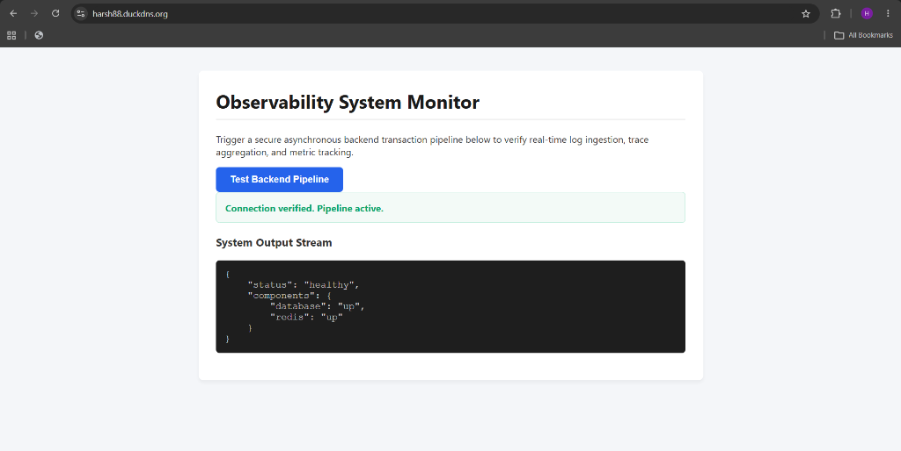
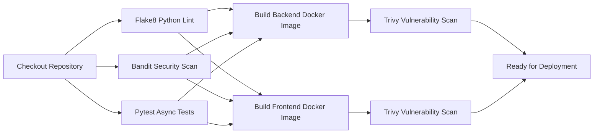
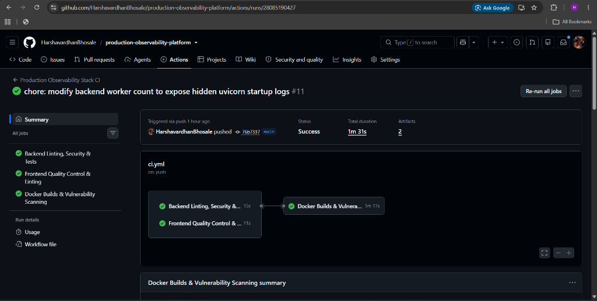
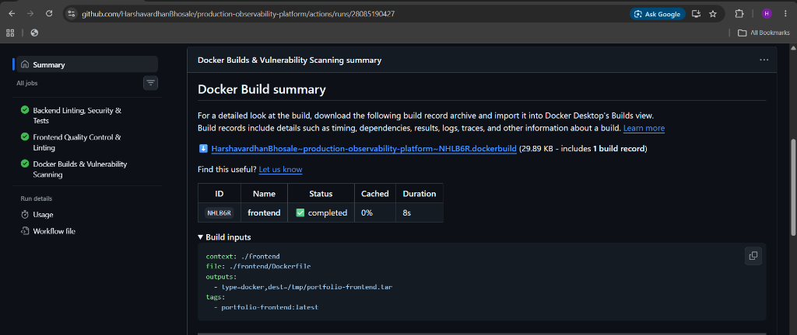
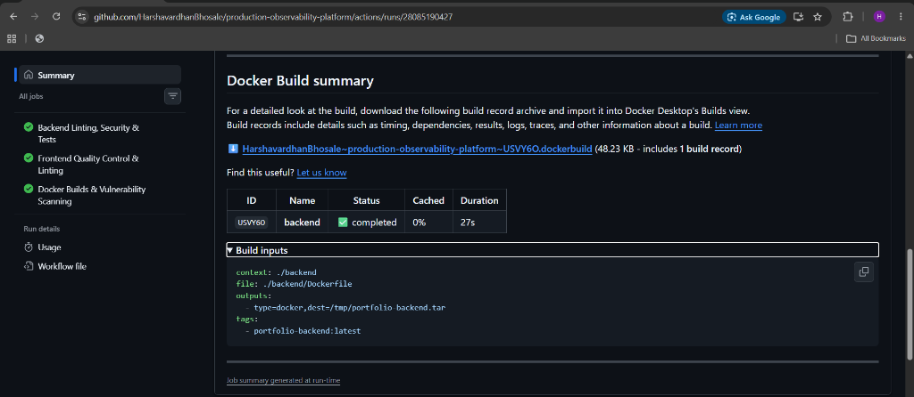
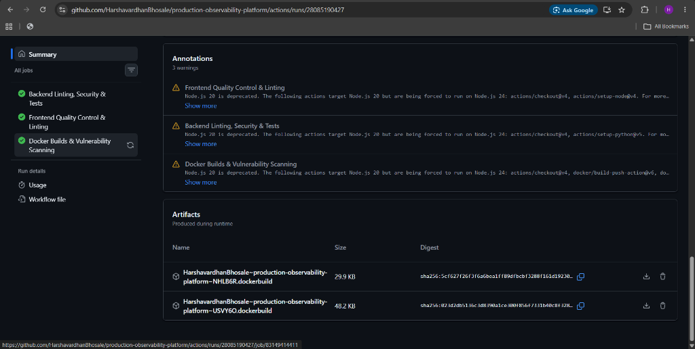

# 🌐 Production-Grade Observability Platform

[](https://github.com/HarshavardhanBhosale/production-observability-platform/actions/workflows/ci.yml)
[](https://github.com/aquasecurity/trivy)
[](LICENSE)
[](https://fastapi.tiangolo.com)
[](https://docs.docker.com/compose/)

A highly-resilient, production-ready observability platform containerized with Docker Compose. This repository demonstrates how to implement a complete telemetry system based on the **Three Pillars of Observability** (Metrics, Logs, and Traces) using industry-standard open-source tools: Prometheus, Loki, Tempo, OpenTelemetry, and Grafana.

The platform includes a modern frontend web interface, a robust asynchronous FastAPI backend (instrumented with SQLAlchemy & Redis tracking), and a hardened Nginx gateway routing traffic over SSL with automatic security policies.

---

## 🗺️ System Architecture

The following diagram illustrates the network topography, data pathways, ingress routing, and telemetry pipelines configured within this platform:

```mermaid
flowchart TD
    subgraph Client Space
        Browser["Web Browser (Client)"]
    end

    subgraph Public Ingress Layer [Nginx Gateway]
        Nginx["Nginx Reverse Proxy (Port 80/443)"]
    end

    subgraph Application Stack [Backend & Cache]
        Frontend["observability-frontend (NodeJS)"]
        Backend["observability-backend (FastAPI)"]
        Postgres["observability-postgres (PostgreSQL)"]
        Redis["observability-redis (Redis)"]
    end

    subgraph Telemetry Collection
        OtelCollector["otel-collector (OTel Collector)"]
        Promtail["promtail (Log Shipper)"]
    end

    subgraph Storage & Analysis Engines
        Tempo["tempo (Traces Store)"]
        Loki["loki (Logs Store)"]
        Prometheus["prometheus (Metrics Engine)"]
        NodeExporter["node-exporter (System Metrics)"]
        cAdvisor["cadvisor (Container Metrics)"]
    end

    subgraph Visualization & Alerting
        Grafana["grafana (Dashboard Portal)"]
        Alertmanager["alertmanager (Alert Routing)"]
        Notifications["Slack / PagerDuty / Email"]
    end

    %% Client Routing
    Browser -->|HTTPS| Nginx
    Nginx -->|Proxy Pass| Frontend
    Nginx -->|/api/| Backend
    Nginx -->|/grafana/ (Basic Auth)| Grafana
    Nginx -->|/alertmanager/ (Basic Auth)| Alertmanager

    %% Application Internal Traffic
    Frontend -->|HTTP API| Backend
    Backend -->|Async Session| Postgres
    Backend -->|Cache/Queue Ping| Redis

    %% Traces Pipeline
    Backend -->|OTLP Traces| OtelCollector
    OtelCollector -->|OTLP / gRPC| Tempo

    %% Logs Pipeline
    DockerSocket["/var/run/docker.sock"] -.-> Promtail
    Promtail -->|Push API| Loki

    %% Metrics Pipeline
    Prometheus -->|Scrape /metrics| Backend
    Prometheus -->|Scrape| NodeExporter
    Prometheus -->|Scrape| cAdvisor
    Prometheus -->|Self Scrape| Prometheus

    %% Alerting
    Prometheus -->|Send Alerts| Alertmanager
    Alertmanager -->|Webhooks/API| Notifications

    %% Dashboards Data Retrieval
    Grafana -->|Query Metrics| Prometheus
    Grafana -->|Query Traces| Tempo
    Grafana -->|Query Logs| Loki
```

---

## 🖥️ Platform Dashboard Preview

The platform includes an **Observability System Monitor** web dashboard designed to trigger transactions and verify active logging, metric, and tracing pipelines:



---

## 🛠️ Service Infrastructure Matrix

The platform is decomposed into the following microservices, orchestrated dynamically within isolated container networks (`public-net`, `backend-net`, `monitoring-net`):

| Service Name | Container Name | Base Docker Image | Ports Exposed / Internal | Responsibility |
| :--- | :--- | :--- | :--- | :--- |
| **Nginx** | `observability-nginx` | `nginx:1.27-alpine` | `80`, `443` | Public ingress router, SSL termination (Let's Encrypt), basic authentication for telemetry dashboards. |
| **Frontend** | `observability-frontend` | Custom Node builder | `3000` (Internal) | Web application serving the dashboard monitor interface. |
| **Backend** | `observability-backend` | Custom Python 3.11 builder | `8000` (Internal) | Asynchronous FastAPI REST API. Instrumented with OpenTelemetry for Database & Redis operations. |
| **PostgreSQL** | `observability-postgres` | `postgres:16-alpine` | `5432` (Internal) | Core relational datastore, configured with health checks and persistence. |
| **Redis** | `observability-redis` | `redis:7.2-alpine` | `6379` (Internal) | Memory cache, configured with append-only logs for durability. |
| **Prometheus** | `observability-prometheus` | `prom/prometheus:v2.54.1` | `9090` (Internal) | Central metric engine scraping endpoints and evaluating alerting rules. |
| **Node Exporter** | `observability-node-exporter` | `prom/node-exporter:v1.8.2` | `9100` (Internal) | Pulls system-level hardware metrics (CPU, Memory, Disk, Network) from the host. |
| **cAdvisor** | `observability-cadvisor` | `gcr.io/cadvisor/cadvisor:v0.49.1` | `8080` (Internal) | Analyzes resource usage and performance characteristics of running containers. |
| **Alertmanager** | `observability-alertmanager` | `prom/alertmanager:v0.27.0` | `9093` (Internal) | Processes alerts from Prometheus and dispatches notifications. |
| **Loki** | `observability-loki` | `grafana/loki:3.0.0` | `3100` (Internal) | Log aggregation engine storing indexed chunks of container logs. |
| **Promtail** | `observability-promtail` | `grafana/promtail:3.0.0` | `9080` (Internal) | Log shipper that tails docker container logs via the host docker socket. |
| **Tempo** | `observability-tempo` | `grafana/tempo:2.4.1` | `3200` (Internal) | High-volume distributed tracing storage engine. |
| **OTel Collector** | `observability-otel-collector` | `otel/opentelemetry-collector-contrib:0.98.0` | `4317` (gRPC), `4318` (HTTP) | OpenTelemetry collector aggregating and processing spans before exporting to Tempo. |
| **Grafana** | `observability-grafana` | `grafana/grafana:11.1.0` | `3000` (Internal) | Unified analytics UI querying Loki, Tempo, and Prometheus. |

---

## ⚡ Quick Start (Local Development)

### 📋 Prerequisites
Ensure you have the following software installed locally:
- [Docker Engine](https://docs.docker.com/engine/install/) (v24.0.0 or higher)
- [Docker Compose](https://docs.docker.com/compose/install/) (v2.20.0 or higher)
- A tool to request endpoints (e.g., `curl`, Postman, or a web browser)

### 🚀 Launching the Stack
1. Clone the repository and navigate to the project directory:
   ```bash
   git clone https://github.com/HarshavardhanBhosale/production-observability-platform.git
   cd production-observability-platform
   ```
2. Launch the orchestrator in detached mode:
   ```bash
   docker compose up -d --build
   ```
3. Verify that all 14 containers are running and healthy:
   ```bash
   docker compose ps
   ```

### 🔐 Accessing Local Services
For local development without an active Nginx routing layer mapping to SSL, you can map ports in the `docker-compose.yml` to inspect the dashboards directly:
- **Frontend Dashboard:** `http://localhost:3000` (or `http://localhost` if routed via Nginx)
- **FastAPI Documentation:** `http://localhost:8000/docs`
- **Grafana UI:** `http://localhost:3000/grafana/` (default credentials: `admin` / `admin_secure_password`)
- **Prometheus Dashboard:** `http://localhost:9090`
- **Alertmanager Portal:** `http://localhost:9093`

---

## 🌐 Production Deployment Guide

Deploying this stack into a production environment requires setting up external domain routing, hardening SSL parameters, and securing access control credentials.

### 1. Nginx SSL Setup (Let's Encrypt)
On your host server, install Certbot and retrieve SSL certificates for your domain (e.g., `harsh88.duckdns.org`):
```bash
sudo apt update
sudo apt install certbot python3-certbot-nginx
sudo certbot certonly --standalone -d harsh88.duckdns.org -d www.harsh88.duckdns.org
```
Ensure the certs are saved under `/etc/letsencrypt/live/harsh88.duckdns.org/` and volume-mounted into the Nginx container as defined in the `docker-compose.yml`:
```yaml
volumes:
  - ./nginx/nginx.conf:/etc/nginx/nginx.conf:ro
  - ./nginx/.htpasswd:/etc/nginx/.htpasswd:ro
  - /etc/letsencrypt:/etc/letsencrypt:ro
```

### 2. Configure Basic Authentication
Secure the Grafana portal and Alertmanager gateways by generating credentials for authorized admins:
```bash
sudo apt install apache2-utils
# Create the password file (replace admin_user with your username)
htpasswd -c ./nginx/.htpasswd admin_user
```
The Nginx config is pre-hardened to check this file for routes matching `/grafana/` and `/alertmanager/`:
```nginx
location /grafana/ {
    auth_basic "Observability Platform Admin";
    auth_basic_user_file /etc/nginx/.htpasswd;
    ...
}
```

### 3. Production Environment Configuration
For secure database credentials, do not hardcode passwords. Set them in a `.env` file in the root directory prior to running `docker compose`:
```env
POSTGRES_PASSWORD=your_super_secure_postgres_pass
GRAFANA_PASSWORD=your_super_secure_grafana_pass
```

---

## 📊 Deep-Dive: Telemetry Pipelines

### 1. 📈 Metric Ingestion Pipeline
- **FASTAPI App Instrumentor:** Exposes HTTP metrics at `/metrics` using the Prometheus client library.
- **Node & cAdvisor Exporters:** Ship infrastructure performance metrics (memory usage, network activity, CPU constraints) to Prometheus.
- **Data flow:**
  `FastAPI / Node Exporter / cAdvisor` ──(Scraped every 15s)──> `Prometheus` ──(Read queries)──> `Grafana`

### 2. 🔍 Distributed Tracing Pipeline
- **Instrumentation:** The FastAPI application uses the OpenTelemetry SDK to instrument SQLAlchemy database transactions and Redis cached operations:
  ```python
  SQLAlchemyInstrumentor().instrument(engine=engine.sync_engine)
  RedisInstrumentor().instrument(client=redis_client)
  ```
- **OTel Collector:** A lightweight daemon receives structured span telemetry, groups them, and pushes them to Tempo.
- **Data flow:**
  `FastAPI (OTel SDK)` ──(OTLP/gRPC)──> `OTel Collector` ──(Batch Export)──> `Tempo` ──(Query Spans)──> `Grafana`

### 3. 📝 Structured Logging Pipeline
- **Structured Logging:** FastAPI generates structured JSON logs using `structlog`.
- **Log Shipper:** Promtail runs on the system, tracking docker daemon stdout and stderr.
- **Data flow:**
  `FastAPI Logs (stdout)` ──> `Docker Daemon` ──> `/var/run/docker.sock` ──> `Promtail` ──> `Loki` ──(LogQL Queries)──> `Grafana`

---

## 🚨 Alerts & Rule Configuration

Alerting thresholds are declared inside [alerts.yml](file:///c:/Users/harsh/OneDrive/Desktop/production-observability-platform/prometheus/alerts.yml). Alertmanager acts as the router to external channels (e.g., Slack or PagerDuty) if thresholds are breached:

### Active Alert Thresholds
- **HostCpuUtilizationHigh:** CPU utilization has breached 90% for over 10 minutes.
- **HostMemoryAvailableLow:** Available RAM has dropped below 10%, indicating imminent out-of-memory killer risk.
- **ServiceDown:** A critical service container (e.g., FastAPI backend, Postgres, Redis) is unreachable for over 1 minute.
- **HighHttpErrorRate:** HTTP 5xx server exceptions exceed 5% of total request throughput over a 2-minute sliding window.
- **HighP99LatencyBreach:** 99% of API clients experience response latency greater than 2 seconds for over 3 minutes.

---

## 🛠️ CI/CD & Security Hardening

The repository enforces software quality controls and security scanning automatically on every pull request and push to the `main` branch via GitHub Actions ([ci.yml](file:///c:/Users/harsh/OneDrive/Desktop/production-observability-platform/.github/workflows/ci.yml)):



- **Linter:** Python style checks are enforced with `flake8`.
- **Security Check:** Static code analysis using `bandit` scans for hardcoded secrets, weak hashes, and security vulnerabilities.
- **Image Scan:** Container security scans are executed on compiled images via `Trivy` to block vulnerabilities (Severity: `HIGH,CRITICAL`) from reaching staging or production registries.

### 🚀 CI/CD Pipeline Execution Summary

The GitHub Actions workflow automates the validation check pipeline on every push. Below are the actual execution runs, compilation summaries, and output artifacts:

#### 1. Workflow Run Overview
The end-to-end pipeline executes linting, security scans, unit testing, and Docker compilation in parallel, completing successfully in **1m 31s**.


#### 2. Container Build Profiles
The pipeline compiles Docker images for the frontend and backend microservices:
- **Frontend Container Build:** Completed in **8s** with `0%` cached steps.
- **Backend Container Build:** Completed in **27s** with `0%` cached steps.

| Frontend Compilation Profile | Backend Compilation Profile |
| :---: | :---: |
|  |  |

#### 3. Build Warnings & Artifacts
- **Runtime Environment:** Deprecation warnings are flagged (e.g., Node.js 20 deprecation) while directing workflows to execute on modern node runner runtimes.
- **Compiled Archives:** Build outputs are compressed and archived as downloadable `.dockerbuild` artifacts.


---

## 📄 License
This project is licensed under the MIT License - see the [LICENSE](LICENSE) file for details.

---
*Maintained with 💻 by [Harshavardhan Bhosale](https://github.com/HarshavardhanBhosale).*
